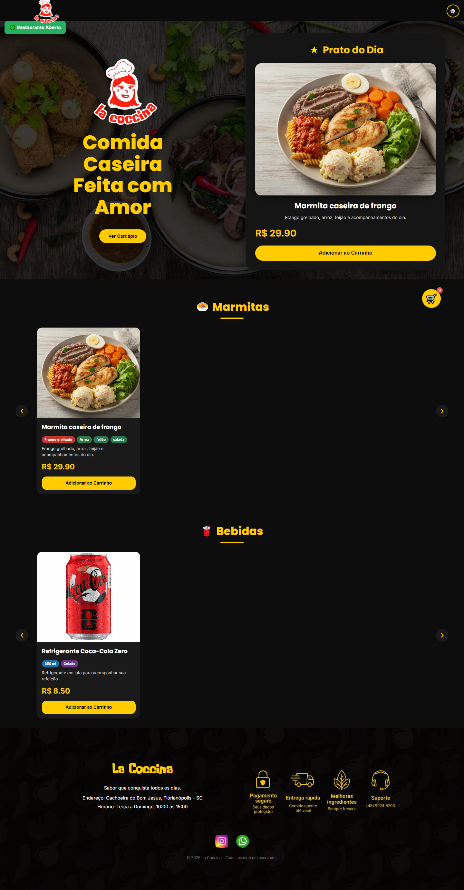
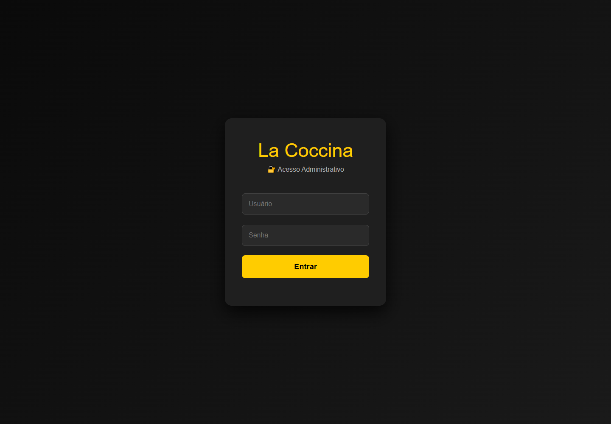
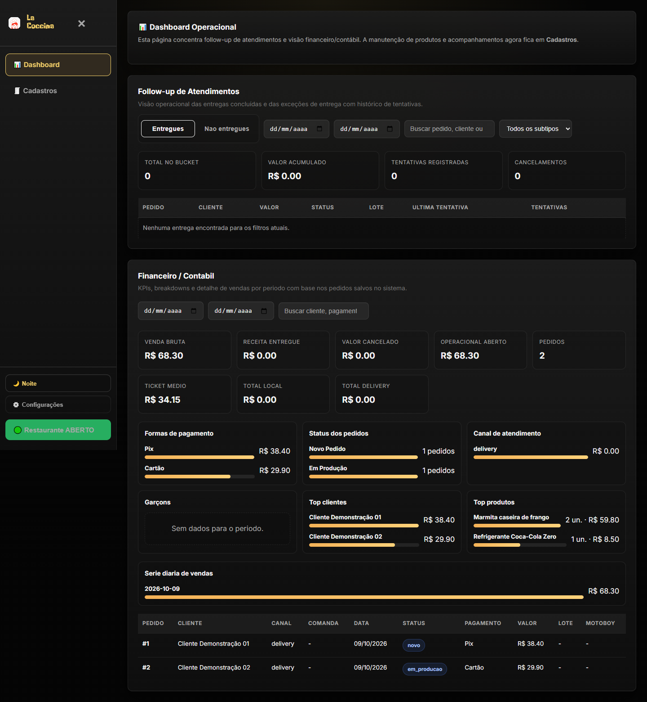
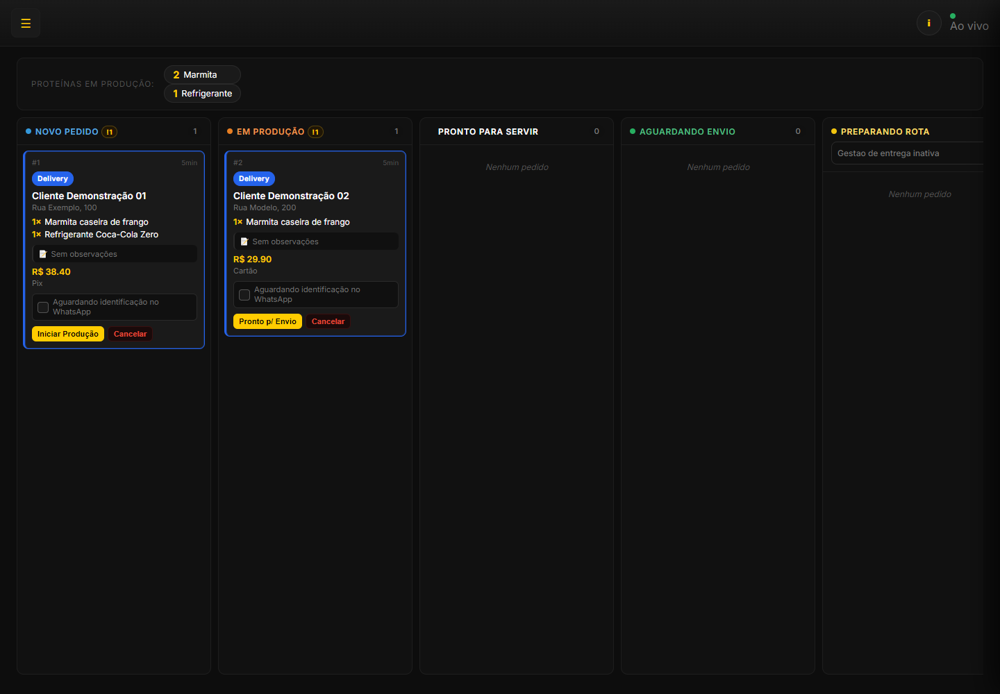

# La Coccina

Sistema web de pedidos e operação para restaurante, com cardápio digital, pedidos online, atendimento por mesa e ferramentas administrativas.

**Site:** [lacoccina.com.br](https://lacoccina.com.br) · **Repositório:** [developmatheus/La-coccina](https://github.com/developmatheus/La-coccina)


**Licença:** software proprietário — todos os direitos reservados. Consulte [LICENSE](LICENSE) para os termos.

## Visão geral

O projeto reúne a experiência do cliente e a operação do restaurante em uma aplicação. O frontend é feito com HTML, CSS e JavaScript; o backend em Node.js e Express fornece a API, autenticação, persistência SQLite e arquivos do site.

## Funcionalidades

### Cliente

- Cardápio online com marmitas, bebidas, prato do dia e disponibilidade atualizada.
- Seleção de acompanhamentos, carrinho e finalização do pedido pelo WhatsApp.
- Consulta do andamento do pedido por um link de rastreamento.
- Cardápio por QR Code para mesas, com envio de itens para a comanda.

### Administração e operação

- Login administrativo e manutenção de produtos, preços, disponibilidade e acompanhamentos.
- Configuração de entrega, áreas atendidas, mesas, garçons e atendimento local.
- Kanban para acompanhar e atualizar os pedidos, com notificações de mudanças em tempo real.
- Dashboard com acompanhamento de atendimentos e informações financeiras dos pedidos.
- Preparação de lotes de entrega e interface para o entregador acompanhar paradas e atualizar o status.
- Atendimento local para abrir comandas, adicionar itens, enviar pedidos para a cozinha, transferir mesas e fechar contas.

### Páginas principais

| Página | Caminho |
| --- | --- |
| Cardápio público | `/` |
| Carrinho | `/cart.html` |
| Cardápio de mesa | `/cardapio-mesa.html` |
| Acompanhar pedido | `/track.html?token=...` |
| Login administrativo | `/admin/login.html` |
| Dashboard | `/admin/dashboard.html` |
| Kanban de pedidos | `/admin/kanban.html` |
| Cadastros e configurações | `/admin/cadastros.html` |
| Atendimento local | `/local-service.html` |
| Interface do entregador | `/delivery-batch.html?token=...` |

## Demonstração visual

As capturas abaixo mostram o cardápio público e áreas administrativas do sistema. Os pedidos exibidos nas telas administrativas são dados fictícios de demonstração.









## Tecnologias

- **Frontend:** HTML5, CSS3 e JavaScript.
- **Backend:** Node.js 20, Express e API REST.
- **Dados:** SQLite com migrations versionadas.
- **Segurança:** Helmet, CORS configurável, limite de requisições, autenticação administrativa e validação de entradas.
- **Automação de fluxos:** Playwright.
- **Hospedagem:** configuração de serviço no Render em `render.yaml`.

## Estrutura do repositório

```text
Frontend/                 Páginas, estilos, scripts e assets do navegador
  admin/                  Login e módulos administrativos
  ASSETS/                 CSS, JavaScript, imagens e fontes
backend/                  API Express, banco, rotas e migrations
  config/.env.example     Exemplo de configuração local
  routes/                 Endpoints da API
  migrations/             Evolução do esquema SQLite
docs/                     Arquitetura, segurança e documentação operacional
scripts/demos/            Scripts de demonstração e geração de mídia
tests/e2e/                Automações Playwright de fluxos
UPLOADS/                  Imagens do cardápio versionadas
```

O frontend e o backend permanecem em pastas separadas porque o servidor e a configuração de hospedagem esperam esses caminhos.

## Executar localmente

Requisitos: Node.js 20 e npm.

```bash
git clone https://github.com/developmatheus/La-coccina.git
cd La-coccina/backend
npm ci
```

Copie `config/.env.example` para `config/.env` e configure pelo menos:

```env
ADMIN_USERNAME=seu_usuario
ADMIN_PASSWORD=hash_bcrypt_da_senha
SESSION_SECRET=uma_chave_aleatoria_com_pelo_menos_32_caracteres
```

Gere o hash da senha com:

```bash
npm run hash-password -- "sua_senha"
```

Coloque o valor gerado em `ADMIN_PASSWORD` no arquivo `config/.env`. Não use senhas de exemplo em produção e não envie o `.env` ao Git.

Inicie o servidor:

```bash
npm start
```

O servidor fica disponível em `http://localhost:3001`. O comando de inicialização aplica migrations pendentes antes de iniciar a API e servir o frontend.

Para desenvolvimento com reinicialização automática:

```bash
npm run dev
```

Execute os testes unitários com:

```bash
npm test
```

## Configuração

As variáveis são lidas de `backend/config/.env`. O arquivo `backend/config/.env.example` lista as opções disponíveis, incluindo:

- `DB_PATH`: caminho do banco SQLite.
- `UPLOAD_DIR`: pasta para imagens enviadas pelo painel.
- `PORT` e `NODE_ENV`: porta e ambiente do servidor.
- `CORS_ORIGINS`: origens adicionais autorizadas.
- `GOOGLE_MAPS_API_KEY`: chave usada pelos recursos de mapa e entrega.

Em produção, configure armazenamento persistente para o banco e para os uploads no provedor de hospedagem. Configure as variáveis sensíveis no painel do provedor, nunca no repositório.

## Automações de navegador

Os fluxos Playwright usam `BASE_URL` para selecionar o servidor-alvo e podem criar pedidos de demonstração. Execute-os somente em ambiente local ou de testes, nunca contra dados reais de produção.

Na raiz do projeto, instale as dependências de desenvolvimento e os navegadores do Playwright. Os fluxos exigem credenciais de teste configuradas no ambiente; não há senha padrão.

```bash
npm ci
npx playwright install chromium
```

No PowerShell, configure as variáveis do fluxo de personas:

```powershell
$env:BASE_URL = "http://localhost:3001"
$env:ADMIN_USERNAME = "usuario-local"
$env:ADMIN_PASSWORD = "senha-local"
$env:DRIVER_TOKEN = "token-de-lote-local"
npm run playwright:personas
```

Para o fluxo cliente → Kanban, configure `BASE_URL`, `ADMIN_USERNAME` e `ADMIN_PASSWORD` e execute `npm run playwright:order-kanban`. Os fluxos podem criar pedidos: use apenas ambiente local ou de testes, nunca dados reais de produção.

O workflow em `.github/workflows/ci.yml` verifica a sintaxe JavaScript, valida os metadados JSON e executa os testes unitários. Ele não abre navegador nem cria pedidos.

## Documentação adicional

- [Arquitetura](docs/arquitetura.md)
- [Segurança e configuração](docs/seguranca.md)
- [Fluxo de entregas](docs/fluxo-entregas-mermaid.md)
