# Fluxos De Entrega

Este documento descreve os fluxos operacionais do ciclo de entrega no La Coccina, incluindo as transicoes do pedido, do lote, do motoboy e as regras de visibilidade/LGPD.

## Regras Gerais

- O pedido entra no fluxo normal de venda ate chegar ao ponto de expedicao.
- Um lote de entrega agrupa pedidos que estao em `preparando_rota`.
- O motoboy so pode operar o lote depois de aceitar o lote.
- A cozinha ainda precisa confirmar a saida para o lote virar `liberado_cozinha`.
- A rota principal mostra apenas pedidos elegiveis:
  - nao entregues
  - nao cancelados
  - nao adiados
- Pedidos adiados ou cancelados saem da fila principal e ficam em `deferredStops`.
- Se nao houver mais parada elegivel:
  - a parada atual vira `null`
  - a janela de visualizacao LGPD inicia
- A visualizacao de dados do cliente fica:
  - livre durante entrega ativa
  - livre por 2 minutos sem entrega ativa
  - bloqueada apos isso
  - reaberta por 10 minutos se o restaurante autorizar a extensao

## Fluxo Macro

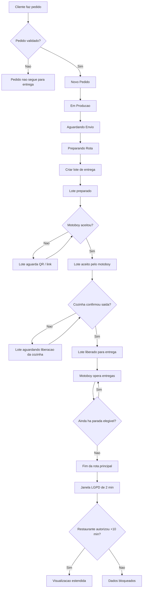

## Estados Do Lote

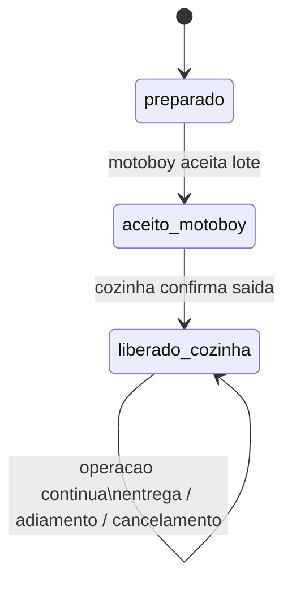

## Fluxo Do Motoboy No Lote

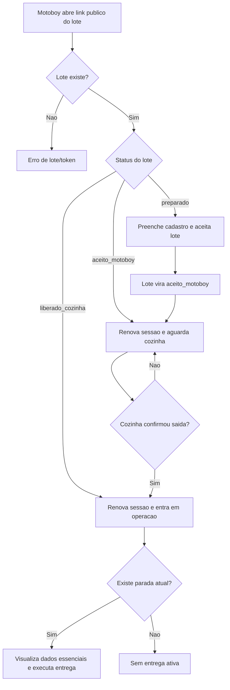

## Fluxo De Navegacao Da Rota

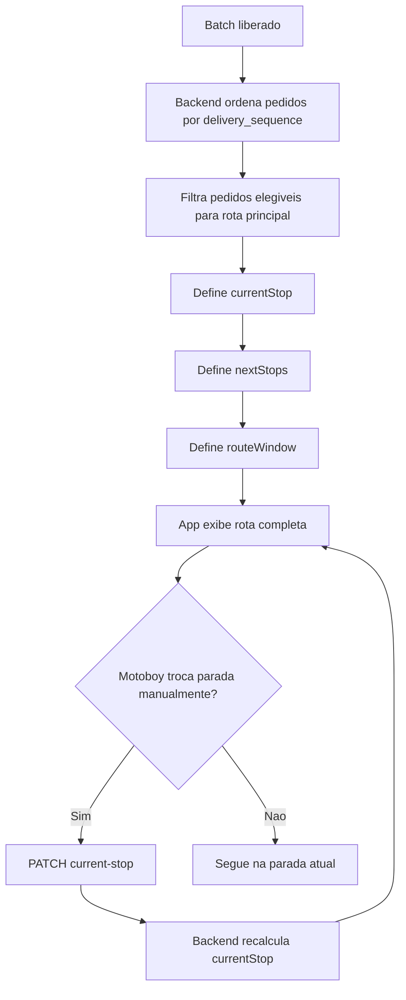

## Pedido Entregue

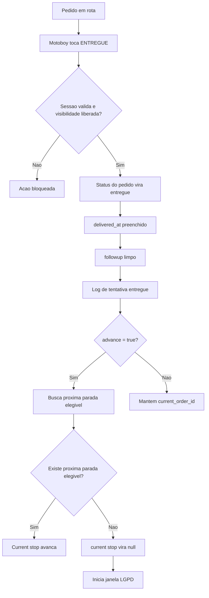

## Pedido Nao Entregue

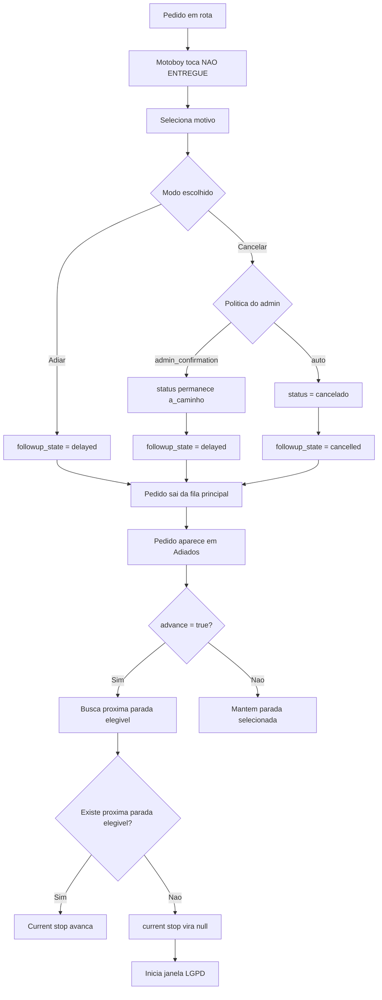

## O Que Acontece Quando O Motoboy Adia

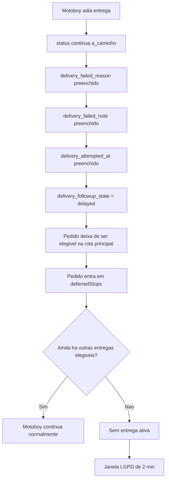

## O Que Acontece Se Cancelar

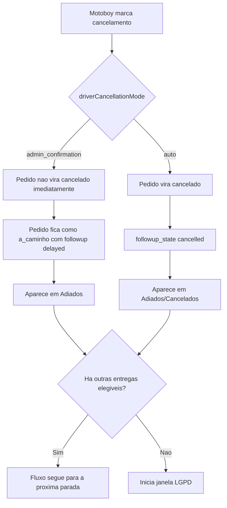

## E Se For A Ultima Entrega?

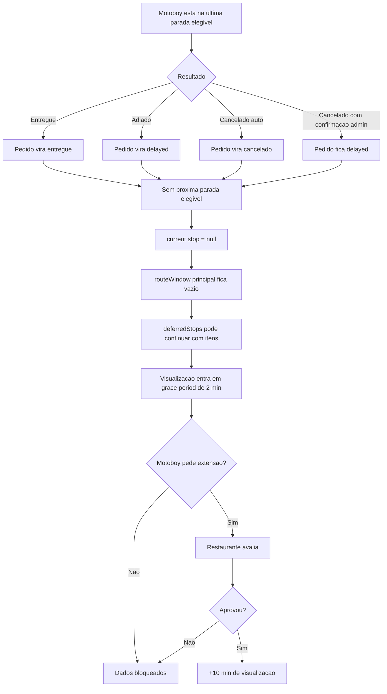

## Pode Fazer Depois Que Todas As Entregas Acabaram?

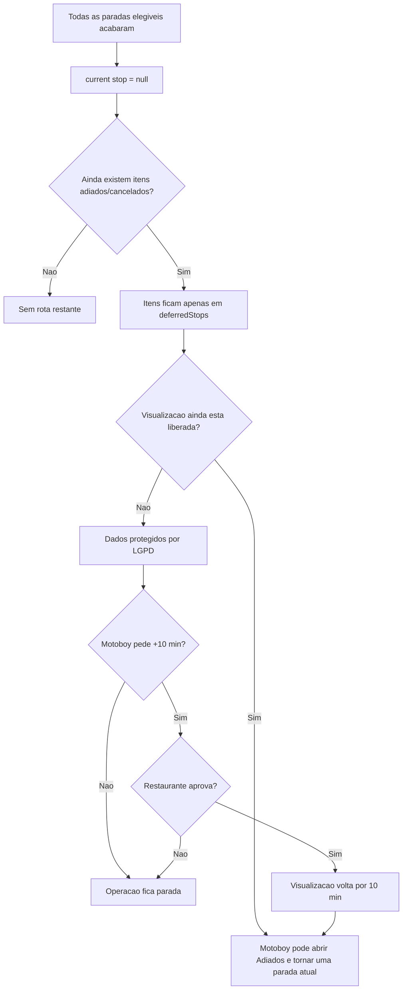

## Fluxo LGPD Da Visualizacao

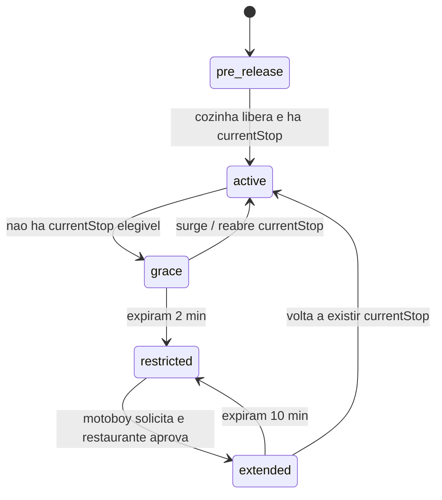

## Condicoes De Visibilidade No PWA

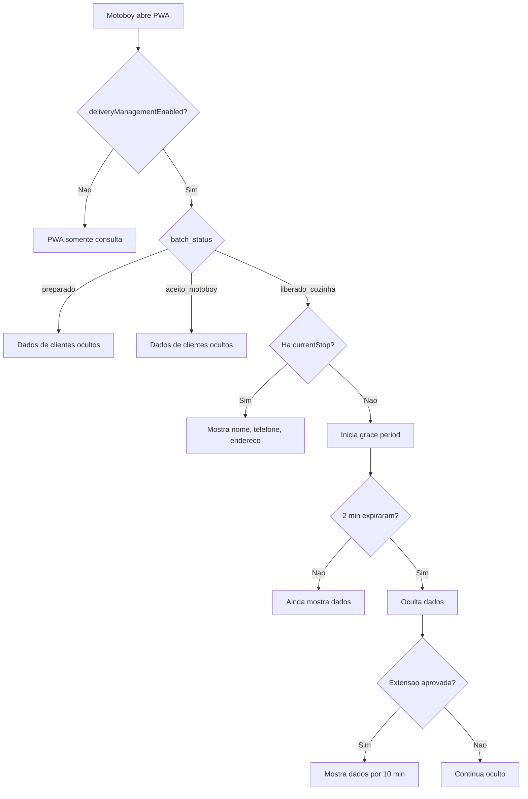

## Fluxo De Reabertura De Pedido Adiado

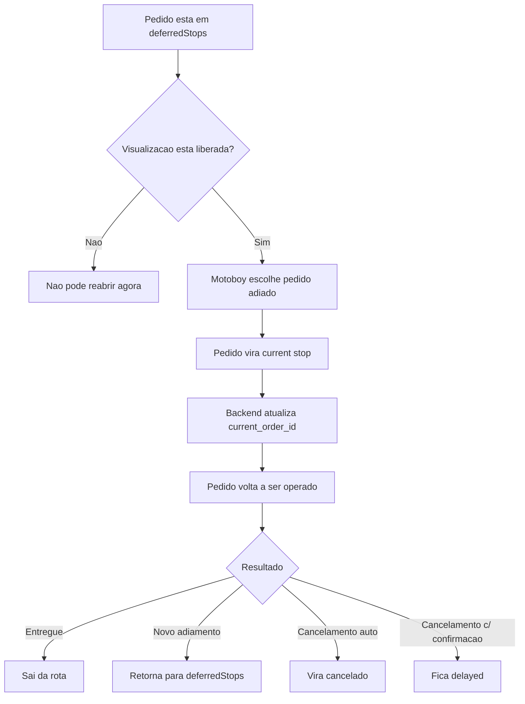

## Observacoes Importantes

- O pedido `cancelado` nunca volta para a rota principal automaticamente.
- O pedido `delayed` continua operacionalmente disponivel apenas pela area de adiados.
- Se o motoboy estiver sem entrega ativa e nao houver extensao aprovada, a visibilidade bloqueia mesmo que ainda existam itens adiados.
- Se o pedido for a ultima parada elegivel, qualquer desfecho encerra a rota principal e ativa a regra de LGPD.
- No modo `admin_confirmation`, o motoboy nao conclui o cancelamento final; ele apenas registra a ocorrencia e tira o pedido da fila principal.
